# Connect Express - Project Overview & Algorithm Logic

## 1. Project Overview
**Connect Express** is a railway routing application designed to find train connections between stations. It calculates both **direct routes** (A to B) and **connecting routes** (A to X to B) with realistic layover times.

### Architecture
- **Backend**: Node.js + Express.js
- **Database**: MongoDB Atlas (Cloud)
- **Data Model**:
  - `Stations`: Stores station code, name, and state.
  - `Trains`: Stores train details and an array of `stops` (station code, arrival/departure times).

### Key Features
- **Smart Routing**: Finds routes even if no direct train exists.
- **Realistic Time Calculations**: Handles day changes (e.g., train departing at 11 PM and arriving at 2 AM next day).
- **Layover Constraints**: Ensures connections are feasible (e.g., minimum 1 hour, maximum 12 hours waiting time).
- **High Performance**: Uses a **C++ Addon** for routing calculations via **N-API**.

---

## 2. Algorithm Explanation: How it Works

### Direct Trains (Simple Search)
This is a straightforward database query.
1. Find all trains where the route contains **both** the Source and Destination stations.
2. Check if Source index < Destination index (train must go *from* A *to* B, not the reverse).
3. Calculate duration.

### Connecting Trains (The "Brute Force" Logic)
This is where the heavy lifting happens. We use a **Meet-in-the-Middle** strategy with a brute-force verification step inside our **C++ Engine**.

**The "Brute Force" Steps:**
1. **Fetch Candidate Trains**: 
   - Get ALL trains passing through Source (Station A).
   - Get ALL trains passing through Destination (Station B).
   
2. **Map Potential Connections**:
   - For every train from A, list all stations it visits *after* A.
   - For every train to B, list all stations it comes from *before* B.

3. **Find Intersection (Common Stations)**:
   - Identify stations that exist in both lists. These are potential connecting points (Station X).

4. **Brute Force Verification**: 
   - For every Common Station (X):
     - Loop through EVERY train arriving at X from A.
     - Loop through EVERY train departing X to B.
     - **Check**: Is `Arrival Time at X` + `Layover` <= `Departure Time from X`?
     - If yes, valid connection found.

**Why is it called Brute Force?**
Because the computer checks **thousands of combinations** instantly. If there are 5 trains from A->X and 5 trains from X->B, the system checks 25 pairs for *just that one station*. It does this for every possible shared station.

---

## 3. High-Performance C++ Integration (N-API)

To achieve maximum efficiency, the complex "brute force" routing logic is implemented in **C++** and accessed from Node.js using **N-API** (Node-API).

### Why N-API + Shared Library?
We use a **shared library (.node)** architecture for the best of both worlds:
1. **Performance**: Takes advantage of C++'s raw speed for CPU-intensive loops.
2. **Efficiency**: Avoids the overhead of starting new processes (spawning child processes).
3. **Integration**: Allows JavaScript to call C++ functions **synchronously** as if they were native JS functions.

### Complete Data Flow: End-to-End

```mermaid
sequenceDiagram
    participant User as Browser (React)
    participant Node as Node.js (Backend)
    participant DB as MongoDB
    participant NAPI as N-API Bridge
    participant CPP as C++ Engine

    User->>Node: GET /api/search?from=MAS&to=SBC
    Node->>DB: Fetch ALL trains
    DB-->>Node: Return JS Array of Trains
    
    Note over Node, CPP: ⚡ CROSSING THE BRIDGE ⚡
    
    Node->>NAPI: Call findConnectingRoutes(trains)
    NAPI->>CPP: Convert JS Array → C++ Vector
    
    rect rgb(20, 20, 20)
        Note right of CPP: 🚀 C++ ALGORITHM RUNS
        CPP->>CPP: Hash Trains by Station
        CPP->>CPP: Find Intersections
        CPP->>CPP: Validate Layovers
        CPP->>CPP: Sort by Duration
    end
    
    CPP->>NAPI: Return std::vector<Route>
    NAPI->>Node: Convert C++ Vector → JS Array
    
    Note over Node, CPP: ⚡ BACK TO JAVASCRIPT ⚡
    
    Node-->>User: JSON Response { routes: [...] }
    User-->>User: Render Results UI
```

### The 3 Phases of Execution

**Phase 1: Build Time (npm install)**
- `cmake-js` compiles `router.cpp`
- Creates a shared library binary: `build/Release/route_engine.node` (~200KB)

**Phase 2: Server Start (npm start)**
- Node.js loads the binary into memory using `require()`.
- The C++ functions are now available to the Node.js process.

**Phase 3: Runtime (User Request)**
- **Input**: JS Array of train objects.
- **Processing**: Data crosses the N-API bridge, gets processed at C++ speed (~0.03ms).
- **Output**: Resulting routes are converted back to JS objects and sent to the user.

---

## 4. Caching Strategy (Redis)

We implement a **Cache-Aside** strategy to improve performance for frequent searches.

- **Cache Key**: `search:{FROM_STATION}:{TO_STATION}` (e.g., `search:MAS:SBC`)
- **Cache Value**: The complete JSON response containing both direct and connecting routes.
- **TTL (Time-To-Live)**: 1 hour (3600 seconds).
- **Behavior**: 
  1. Check Redis cache first.
  2. If found, return cached JSON immediately.
  3. If missing (or Redis down), compute routes using MongoDB/C++.
  4. Store result in Redis for future requests.
- **Degradation**: If Redis is unreachable, the system gracefully falls back to the database without crashing.

---

## 5. Practical Example: Multi-User Scenario

### Scenario: 3 Users Searching Simultaneously
**Current State**: Server running on port 5002, connected to MongoDB Atlas (212 trains).

#### User 1: "Business Traveler"
- **Search**: `MAS` (Chennai) → `SBC` (Bangalore)
- **Action**: 
  - System finds 12 direct trains.
  - **Result**: Immediate response. Shows "Shatabdi Express" (Duration: 5h).

#### User 2: "Budget Student"
- **Search**: `MAS` (Chennai) → `CBE` (Coimbatore)
- **Action**:
  - Direct trains found: 9.
  - **Connecting Logic Triggered**:
    - Finds common stations: `KPD`, `SA`, `ED`.
    - **Brute Force (C++)**: Checks connection `MAS -> KPD` (Train 1) + `KPD -> CBE` (Train 2).
    - Checks 263 possibilities in milliseconds.
  - **Result**: Shows 20 best options sorted by total duration.

#### User 3: "Explorer"
- **Search**: `NDL` (Nandyal) → `MAQ` (Mangalore)
- **Action**:
  - Direct trains: 0.
  - Connecting search begins. Finds common stations `GTL` (Guntakal) and `SBC` (Bangalore).
  - System calculates: Train A reaches `GTL` at 2:00 AM. Train B leaves `GTL` for `MAQ` at 4:30 AM.
  - **Result**: Valid connection found via Guntakal with 2.5hr layover.

### System Reaction
Since Node.js is **asynchronous** and the C++ engine is **cpu-bound but fast**:
1. Node accepts User 1's request -> Starts database query.
2. While database looks for User 1, it accepts User 2's request.
3. User 1's data returns -> Response sent.
4. User 2's complex calculation runs in C++ (blocking the thread for only a microscopic ~0.03ms).
5. User 3's request is handled almost instantly after.

Even with the "brute force" logic, the calculation happens in milliseconds because compiled C++ code is highly optimized for checking logic conditions (Time A < Time B), handling thousands of checks in a fraction of a second.
